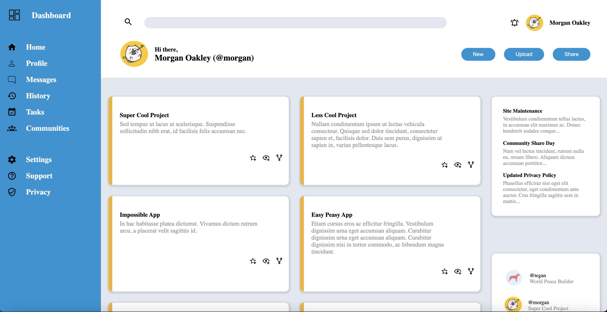

# Project Title

Admin Dashboard.

## Description
This project was done under TOP and is a project geared at making use of concenpts learned under css.

Build a full dashboard design. For this project, use whatever tools you need to get it done, but try to lean on Grid for the majority of the layout work. Go back through the lessons or practice assignments if you need a refresher.

## Author

Ndzi Nfor

## Demo

## The Odin Project (Web development) Completed projects
 
* First Project - Recipes [basic HTML]
* Second Project - Landing Page [HTML | basic CSS + flexbox]
* Third Project - Rock Paper Scissors [HTML | CSS | Basic JavaScript]
* Fourth Project - Etch-a-Sketch [HTML | CSS | Basic JavaScript + events]
* Fifth Project - Calculator [HTML | CSS | JavaScript]
* [Sixth Project - Sign-up Form](https://github.com/nd31pr0/odin-signup-form-project) [HTML | CSS |]
* [Seventh Project - Admin Dashboard](https://github.com/nd31pr0/Admin-Dashboard) [HTML | CSS | JavaScript]